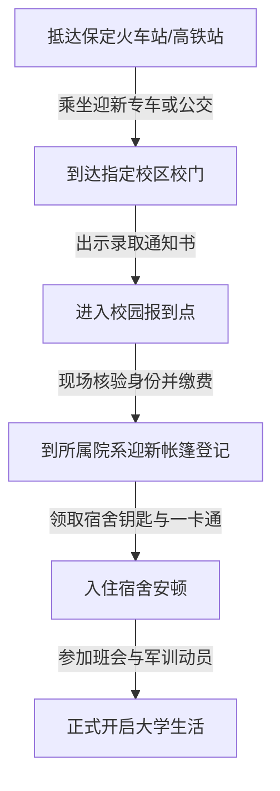

# 🎒 新生指引

欢迎来到河北大学！为了帮助你顺利开启大学生活，我们整理了这份新生入学指引。

## 📌 入学前准备

### 1. 必备证件与材料
- [ ] **录取通知书**（原件）
- [ ] **高考准考证**（部分学部/学院可能需要）
- [ ] **身份证**（原件及正反面复印件若干张）
- [ ] **个人档案**（凭录取通知书到毕业高中领取，切勿自行拆封）
- [ ] **党/团员关系材料**（团员证及团关系介绍信，或通过“智慧团建”线上转接）
- [ ] **户口迁移证**（自愿办理，如需迁移户口请提前准备）
- [ ] **免冠证件照**（红底/蓝底/白底一寸及两寸照片各备一版，电子版存手机）

### 2. 生活用品建议
- **床上用品**：学校通常会提供订购服务（自愿购买），也可自行携带。规格一般为单人床（常见尺寸 $0.9m \times 1.9m$ 或 $0.9m \times 2.0m$）。
- **应季衣物**：保定春秋较短，冬夏较长。建议带足夏装与冬装（羽绒服必带），秋装适量。
- **常用药品**：感冒药、退烧药、防暑药、创可贴、消炎药、胃药、防蚊虫喷雾等。

---

## 🏫 报到当天流程

### 院系迎新点登记
进入校门后，根据指示牌前往你所在的学部/学院迎新点。在这里，你需要：
1. 提交通知书及相关证件。
2. 领取**寝室钥匙**、**校园一卡通/临时卡**。
3. 认识你的辅导员及迎新志愿者（学长学姐）。

---

## 💡 新生温馨提示
> [!TIP]
> 1. **谨防诈骗**：报到期间人员混杂，注意保管好个人财物。任何推销电话卡、英语周报、专升本课程、四六级资料的，切勿轻信。
> 2. **绿色通道**：因家庭经济困难无法缴纳学费的同学，报到当天可持相关证明前往“绿色通道”办理入学手续，申请国家助学贷款。
> 3. **校园交通**：报到当天校内人流量大，建议跟随志愿者步行前往宿舍，避免车辆拥堵。

*(欢迎大家修改和补充更多报到细节！)*
